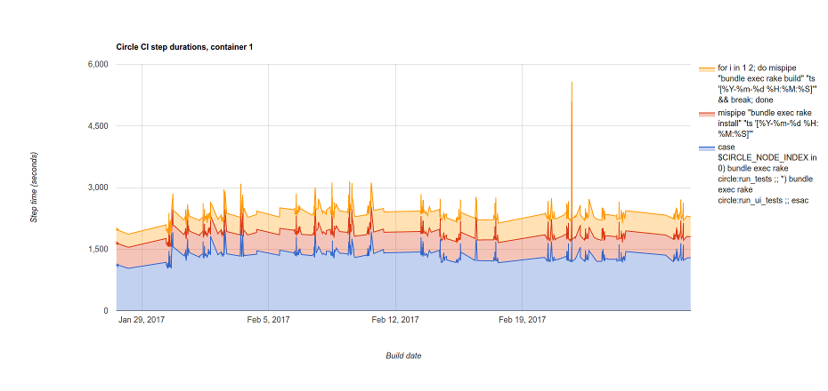

# circlarify
A set of CLI tools for analyzing Circle CI builds via their REST API.

## Setup
We manage dependencies with [Bundler](http://bundler.io/) so please install that first.

From the repository root, run `bundle install`.  Then you should be able to execute the tools directly.

The tools will write to `~/.circlarify` to cache build information and avoid redundant requests to the Circle CI API.  Cached build JSON gets compressed; caching summary data for 10,000 builds requires about 115MB of disk space.

### config.yml
You can optionally create a configuration file at `~/.circlarify/config.yml` to provide some default parameters to all commands.

```yml
# config.yml

# Default repository to use when searching builds
repository: code-dot-org/code-dot-org
```

## Common Options

### Specifying build ranges
All of the tools accept `--start [build-number]` and `--end [build-number]` options that let you specify a build range you'd like to operate on.

* If both `--start` and `--end` are supplied, the tool will use all builds in that range (inclusive).
* If only `--start` is given, the tool will use all builds from that build up to the most recent build.
* If no range is supplied, the tool will use the 30 most recent builds.

### Limiting results to one branch
Most tools accept a `--branch [branch-name]` option that will further limit the selected build range, only including builds on the given branch.

## Tools

### compute-failure-rates
Compute daily build failure rates, optionally grouped by a branch or set of branches.

By default, computes a "Total" rate for all builds in range, a "Pipeline" rate for builds on the `production`, `test` and `staging` branches, and a "Branch" rate for all builds not included in the "Pipeline" rate.
```
╰○ ./compute-failure-rates --start 31800
Downloading 31800..32028 |Time: 00:00:01 | === | Time: 00:00:01
Failure rates for builds 31800..32028 by date (1.0 = 100% failures)
Date                  Total         Pipeline           Branch
2017-02-24    12/59 = 0.203     2/22 = 0.091    10/37 = 0.270
2017-02-26      0/3 = 0.000      0/2 = 0.000      0/1 = 0.000
2017-02-27   22/110 = 0.200     6/40 = 0.150    16/70 = 0.229
2017-02-28      3/6 = 0.500      0/3 = 0.000      3/3 = 1.000

```

You can also pull failure rates for a specific branch.  Here we ask for `staging` branch failure rate:
```
╰○ ./compute-failure-rates --start 31800 --group staging
Downloading 31800..32028 |Time: 00:00:01 | === | Time: 00:00:01
Failure rates for builds 31800..32028 by date (1.0 = 100% failures)
Date                  Total         Pipeline           Branch          staging
2017-02-24    12/59 = 0.203     2/22 = 0.091    10/37 = 0.270     2/19 = 0.105
2017-02-26      0/3 = 0.000      0/2 = 0.000      0/1 = 0.000      0/1 = 0.000
2017-02-27   22/110 = 0.200     6/40 = 0.150    16/70 = 0.229     6/36 = 0.167
2017-02-28      3/6 = 0.500      0/3 = 0.000      3/3 = 1.000      0/2 = 0.000

```

### test-flakiness
Computes failure rates for individual cucumber features.

When not grouped by build time, this tool will generate a list of features sorted by flakiness:

```
╰○ ./test-flakiness --start 31500 --branch staging
Computing flakiness rates on branch staging in builds 31500..32007 (1.0 = 100% failures)
Flake    n Test Name
0.495  216 ChromeLatestWin7_hourOfCodeFinish
0.312  160 ChromeLatestWin7_sharepage
0.262  149 ChromeLatestWin7_pixelation
0.174  132 ChromeLatestWin7_applab_embed
0.142  127 ChromeLatestWin7_legacyShareRemix
0.052  116 ChromeLatestWin7_stepMode
0.044  114 ChromeLatestWin7_applab_sharedApps
0.044  114 ChromeLatestWin7_projects
0.035  113 ChromeLatestWin7_callouts
0.035  114 ChromeLatestWin7_starwars
...
```

Where `Flake` is the failure rate and `n` is the sample size for the given range (total runs of that feature).

You can also group results by date to track flakiness changes over time, and filter results to feature names matching a given pattern.  Here we get flakiness by day for pixelation.feature:
```
╰○ ./test-flakiness --start 31500 --branch staging --group-by day --test pixelation
Computing flakiness rates for test pixelation on branch staging in builds 31500..32009 grouped by day (1.0 = 100% failures)
ChromeLatestWin7_pixelation
{Tue, 21 Feb 2017=>{:flakiness=>0.00, :sample_size=>3},
 Wed, 22 Feb 2017=>{:flakiness=>0.34, :sample_size=>38},
 Thu, 23 Feb 2017=>{:flakiness=>0.31, :sample_size=>45},
 Fri, 24 Feb 2017=>{:flakiness=>0.20, :sample_size=>25},
 Sat, 25 Feb 2017=>{:flakiness=>0.00, :sample_size=>1},
 Mon, 27 Feb 2017=>{:flakiness=>0.19, :sample_size=>32},
 Tue, 28 Feb 2017=>{:flakiness=>0.20, :sample_size=>5}}
```

Options:

* `--test "Test name filter"` - Case-insenstive regular expression for filtering results to a certain test.
* `--group-by (day|week|month)` - Group measurements by the given period for tracking flakiness changes over time.

### search-circle-builds
Helper for grepping through build logs.

Options:

 * `--grep "String to Search for"` - Search for given string.
 * `--whole-lines` - Print entire lines of found strings in output.
 * `--count` - Counts number of found strings in output.
 * `--grep-container [num]` - Search given container # for grep string.
 * `--grep-step [name]` - Search given step (substring) for grep string.

### compute-timing-stats
Figure out which Circle steps take the most time, in successful builds.

This can give you a list of steps by average duration in descending order:
```
╰○ ./compute-timing-stats --branch staging --start 31000                                  
Downloading 31000..32037 |Time: 00:00:05 | === | Time: 00:00:05
Limited to branch: staging
Average build time for 201 successful builds in range 31000..32037
 1:09:26

Average build times for steps
Duration Container Name
   30:02         0 Wait for SSH
   30:02         1 Wait for SSH
   27:58         0 case $CIRCLE_NODE_INDEX in 0) bundle exec rake circle:run_tests ;; *) bundle exec rake circle:run_ui_tests ;; esac
   21:52         1 case $CIRCLE_NODE_INDEX in 0) bundle exec rake circle:run_tests ;; *) bundle exec rake circle:run_ui_tests ;; esac
    8:47         1 mispipe "bundle exec rake install" "ts '[%Y-%m-%d %H:%M:%S]'"
    8:46         0 mispipe "bundle exec rake install" "ts '[%Y-%m-%d %H:%M:%S]'"
    8:22         0 for i in 1 2; do mispipe "bundle exec rake build" "ts '[%Y-%m-%d %H:%M:%S]'" && break; done
    8:21         1 for i in 1 2; do mispipe "bundle exec rake build" "ts '[%Y-%m-%d %H:%M:%S]'" && break; done
    5:46         0 cd apps && npm run storybook:deploy
    3:19         0 Restore source cache
    2:08         1 bundle install --without ''
    2:08         0 bundle install --without ''
```

Or it can generate a graph of step durations over time.  This will attempt to pop open a browser window and render your data with [Google Charts](https://developers.google.com/chart/). Note: Graphing works for only one container at a time right now, and it's _highly_ recommended that you add a step pattern when graphing.

```
╰○ ./compute-timing-stats --branch staging --container 1 --start 30000 --step "rake install|rake build|run_tests" --plot
Downloading 30000..32037 |Time: 00:00:11 | === | Time: 00:00:11
```


Options:
* `--step StepPattern` - Filter results to steps matching given pattern.
* `--container [num]` - Show results from a different container (default 0).
* `--plot` - Display results as a graph.
